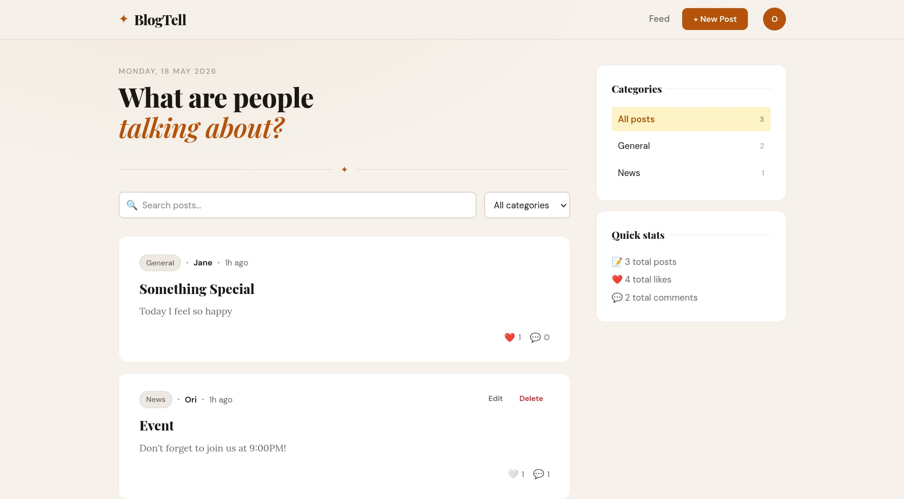

# ✦ BlogTell

A private, self-hosted blog platform for friends and colleagues.
Share thoughts, opinions and news — all stored locally, no third-party tracking.

## Features

- 🔐 Secure account registration & login (JWT + bcrypt)
- 📝 Create, edit, and delete posts
- ❤️ Like posts
- 💬 Comment on posts
- 🏷️ Categories & tags
- 🔍 Live search
- 👤 User profiles with bio
- 📱 Responsive design
- 🚫 No external tracking — zero analytics, zero ads

## Preview

  

## Setup (Using Terminal)

### Create the database
> createdb blogtell

### Run the schema
> psql -d blogtell -f schema.sql

### Install dependencies
> cd backend
> 
> npm i

### Configure environment
> cp .env.example .env

### Edit .env with your PostgreSQL credentials and a strong JWT_SECRET

### Start development server (with hot reload)
>npm run dev

## Privacy & security notes
- Passwords are hashed with **bcrypt** (12 rounds)
- All data stays on your machine — no cloud, no telemetry
